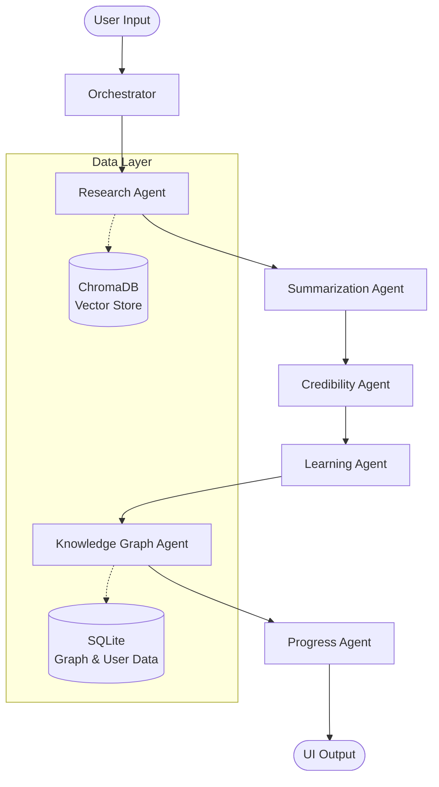

# PRIME - Personal Researcher & Micro-Scientist Agent

**🏆 Kaggle Agents Intensive Capstone Project Submission**

PRIME is an advanced, multi-agent research and learning copilot. It leverages **LangGraph**, **Gemini 1.5 Flash**, **Vector Search**, and **Knowledge Graphs** to transform information overload into structured insights and personalized learning materials.

## 🧠 Architecture

PRIME is orchestrated by a stateful **LangGraph** workflow.



## ✨ Key Features
- **Deep Research**: Autonomous web search and PDF ingestion with RAG.
- **Smart Summarization**: Generates "Study Guides" with definitions, comparisons, and role analysis.
- **Credibility Analysis**: Scores sources for bias and reliability.
- **Active Learning**: Auto-generates **Quizzes** and **Flashcards** from the research.
- **Knowledge Graph**: Visualizes entity relationships (e.g., "Concept A -> CAUSES -> Concept B").
- **PDF Reports**: Download comprehensive, beautifully formatted research reports.

## 🛠️ Tech Stack
- **Orchestration**: LangGraph, LangChain
- **LLM**: Google Gemini 1.5 Flash (via `google-generativeai`)
- **Storage**: ChromaDB (Vector), SQLite (Relational)
- **UI**: Streamlit
- **Tools**: ReportLab (PDF), NetworkX (Graph), DuckDuckGo (Search)

## 🚀 Setup & Usage

1. **Clone the repository**
   ```bash
   git clone https://github.com/yourusername/prime-agent.git
   cd prime-agent
   ```

2. **Install dependencies**
   ```bash
   pip install -r requirements.txt
   ```

3. **Configure Environment**
   Copy `.env.example` to `.env` and add your API keys:
   ```bash
   cp .env.example .env
   ```
   **Required:** `GEMINI_API_KEY` (Get it from Google AI Studio)

4. **Run the Application**
   ```bash
   streamlit run src/prime_agent/ui/app_streamlit.py
   ```

5. **Usage**
   - Open the app in your browser.
   - Enter a topic (e.g., "Quantum Computing") or upload a PDF.
   - Click **Run PRIME**.
   - Explore the tabs: **Summary**, **Notes**, **Quiz**, **Graph**.
   - Click **Download Report** to get a PDF.

## 🧪 Testing
Run the test suite to verify the agents:
```bash
pytest tests/
```
